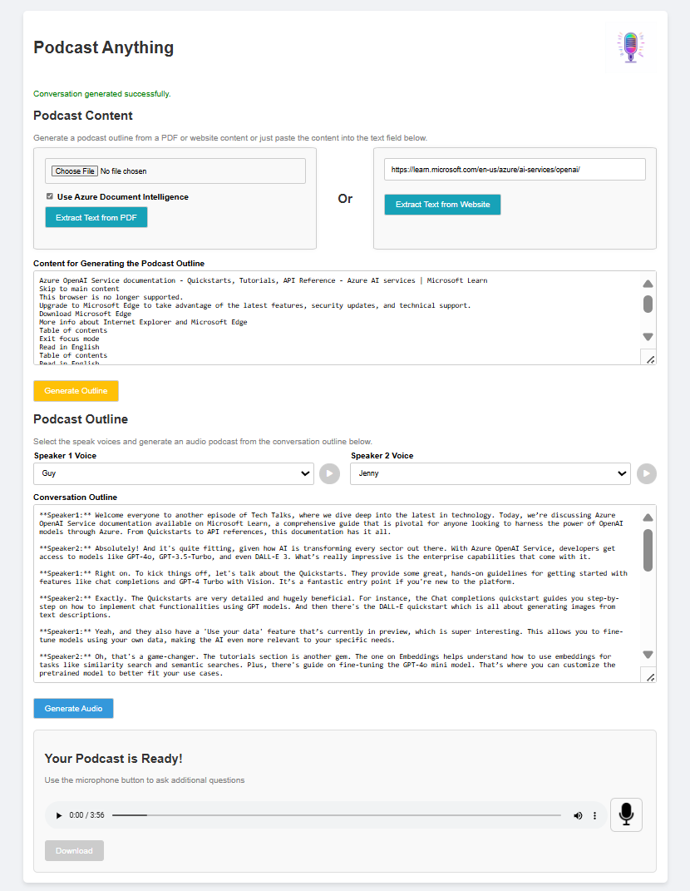

# Podcast Anything (Prototype)

## Introduction

**Podcast Anything** is a prototype application that leverages Artificial Intelligence to transform any type of information into a podcast. Built with an HTML/JavaScript frontend and a Python/Flask backend, the project integrates various Azure AI services and relies heavily on OpenAI's capabilities. This demo project showcases the efficiency gains possible when prototyping with AI technologies, though the code is far from perfect and may require extensive refactoring for production use.

## Project Features

The application offers three input modes:

1. **Fetch Text from a Website**: Users can provide a URL, and the application will extract the textual content from the specified website.
2. **Upload a PDF Document**: Users can upload a PDF file, which is then processed to extract text.
3. **Manually Insert Text**: Users can directly input text into the provided text area.
4. **Generate and Edit the Conversation**: Users can generate the podcast conversation and edit it afterwards.
5. **Listen and Interact with the Podcast**: Listen to the Podcast and ask questions based on the provided content at any time

Once the text is provided through any of the input modes, the application processes it to generate a podcast outline and synthesizes audio using Azure Speech Services.

### Azure Services Used

- **[Azure Document Intelligence](https://learn.microsoft.com/en-us/azure/ai-form-recognizer/)**: *(Optional)* Used for processing and extracting information from PDF documents.
- **[Azure OpenAI GPT-4](https://learn.microsoft.com/en-us/azure/cognitive-services/openai/)**: *(Required)* Utilized for creating the podcast outline from the provided text.
- **[Azure Speech Service](https://learn.microsoft.com/en-us/azure/cognitive-services/speech-service/)**: *(Required)* Generates synthetic voices for the podcast, with support for regions like Sweden Central (e.g., OpenAI voices available in Sweden).

## Installation

### Prerequisites

- **Python 3.11.5**: Ensure you have Python version 3.11.5 installed. You can download it from [Python's official website](https://www.python.org/downloads/).
- **FFmpeg**: Required by `pydub` for audio processing.
  - **Windows**:
    1. Download FFmpeg from [FFmpeg Builds](https://ffmpeg.zeranoe.com/builds/) or the [official site](https://ffmpeg.org/download.html).
    2. Extract the downloaded archive.
    3. Add the `bin` folder (inside the extracted directory) to your system's PATH environment variable.
  - **macOS**:
    ```bash
    brew install ffmpeg
    ```
  - **Linux (Ubuntu/Debian)**:
    ```bash
    sudo apt-get update
    sudo apt-get install ffmpeg
    ```

### Clone the Repository

```bash
git clone https://github.com/yourusername/podcast-anything.git
cd podcast-anything
```

### Create and Activate a Virtual Environment (Recommended)

# Create a virtual environment named 'venv'

```bash
python3 -m venv venv
```

# Activate the virtual environment

# On Windows:

```bash
venv\Scripts\activate
```

# On Unix or MacOS:

```bash
source venv/bin/activate
```

### Install Dependencies

Ensure that you have an updated requirements.txt in your project directory. Install the required Python packages using pip:

```bash
pip install -r requirements.txt
```

### Configuration

## Environment Variables

Create a .env file in the root directory of the project to store your configuration variables securely. Here's an example of what the .env file should contain:

# Flask Secret Key
SECRET_KEY=your_secure_secret_key

# Azure OpenAI Configuration
AZURE_OPENAI_ENDPOINT=your_azure_openai_endpoint
AZURE_OPENAI_API_KEY=your_azure_openai_api_key
AZURE_OPENAI_API_VERSION=your_azure_openai_api_version
AZURE_OPENAI_MODEL_NAME=your_azure_openai_model_name

# Azure Document Intelligence Configuration
DOCUMENTINTELLIGENCE_ENDPOINT=your_document_intelligence_endpoint
DOCUMENTINTELLIGENCE_API_KEY=your_document_intelligence_api_key

# Azure Speech Service Configuration
SPEECH_KEY=your_azure_speech_key
SPEECH_REGION=your_azure_speech_region

# OpenAI API Configuration
OPENAI_API_KEY=your_openai_api_key

Ensure that the .env file is added to your .gitignore to prevent sensitive information from being committed to version control.

### Running the Application

With the virtual environment activated and dependencies installed, start the Flask application:

```bash
python app.py
```

By default, the application will run on http://127.0.0.1:5000. Open this URL in your web browser to access the application.

### Application Architecture

Backend: Python/Flask
Frontend: HTML/JavaScript
AI Services: Azure Cognitive Services (Document Intelligence, OpenAI GPT-4, Speech Service)

### Project Demo Screenshot



## Current Limitations

While the application demonstrates key functionalities, it's important to note that this is a pure demo project. The code is heavily reliant on OpenAI and is far from perfect, requiring significant improvements before it can be considered production-ready. The following features are currently missing:

Session Management for Concurrent Users: Ability to handle multiple users simultaneously without session conflicts.
Enhanced Security Requirements: Improved security measures to protect user data and prevent vulnerabilities.
Streaming / Web Sockets: Real-time communication features for a more dynamic user experience.
Consistent User Experience: More intuitive and user-friendly interface enhancements.
Better Error Handling and Documentation: Robust error handling mechanisms and comprehensive documentation for developers.
Improved Code Structure: Refactoring to divide the code into a more logical and maintainable structure with separate files/modules.

### Future Enhancements

To address the current limitations, future development plans include:

Implementing Server-Side Sessions: Allowing multiple users to interact with the application concurrently without interference.
Enhancing Security: Incorporating authentication, authorization, input validation, and other security best practices.
Integrating Web Sockets: Facilitating real-time features like live audio streaming and user interactions.
User Interface Improvements: Refining the UI for better usability and a more engaging user experience.
Comprehensive Error Handling: Developing robust mechanisms to gracefully handle and log errors.
Modular Codebase: Organizing the code into separate modules and files for better readability and maintenance.

### Contributing

As this is a prototype, contributions are welcome! However, please note that the current codebase may require significant refactoring to accommodate new features or improvements. If you wish to contribute, please follow these steps:

Fork the Repository: Click on the "Fork" button at the top right of the repository page.
Clone Your Fork:

```bash
git clone https://github.com/yourusername/podcast-anything.git
cd podcast-anything
```

Create a New Branch:

```bash
git checkout -b feature/your-feature-name
```

Make Your Changes: Implement your enhancements or fixes.
Commit Your Changes:

```bash
git commit -m "Description of your changes"
Push to Your Fork:
```

```bash
git push origin feature/your-feature-name
```
Create a Pull Request: Navigate to the original repository and click on "Compare & pull request" to submit your changes.

### License
This project is open-source and available under the MIT License.