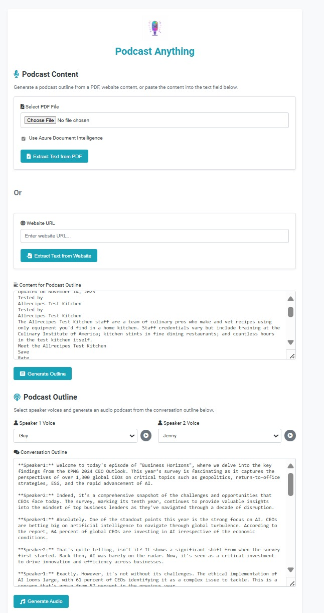

# AI Podcast Outline Generator

This project demonstrates the use of AI to generate podcast as wav file from any text.
The project utilizes a Python/Flask backend and a JavaScript frontend. 
The project heavily leveraged models like OpenAI o1-preview and o1-mini to showcase the efficiency gains when prototyping with AI.

## Project Features

The application offers three modes for input:

1. **Fetch text from a website**
2. **Upload a PDF document**
3. **Manually insert text**

The text is then processed to generate a podcast outline, and audio is synthesized using Azure Speech Services.

### Azure Services Used

- **[Azure Document Intelligence](https://learn.microsoft.com/en-us/azure/ai-form-recognizer/)**: (Optional) For processing and extracting information from PDF documents.
- **[Azure OpenAI GPT-4](https://learn.microsoft.com/en-us/azure/cognitive-services/openai/)**: (Required) For creating the podcast outline from the provided text.
- **[Azure Speech Service](https://learn.microsoft.com/en-us/azure/cognitive-services/speech-service/)**: (Required) To generate synthetic voices, with support for regions like Sweden Central (e.g., OpenAI voices available in Sweden).

### Installation

To install the required dependencies, run the following command:

```bash
pip install -r requirements.txt
```

### Configuration

Ensure you have an `.env` file in the root directory with the following configuration:

```bash
# Azure OpenAI
AZURE_OPENAI_ENDPOINT=
AZURE_OPENAI_API_KEY=
AZURE_OPENAI_API_VERSION=
AZURE_OPENAI_MODEL_NAME=

# Azure Document Intelligence
DOCUMENTINTELLIGENCE_ENDPOINT=
DOCUMENTINTELLIGENCE_API_KEY=

# Azure Speech Service
SPEECH_KEY=
SPEECH_REGION="swedencentral"
```

### Application Architecture

- **Backend**: Python/Flask
- **Frontend**: JavaScript

### Running the App

To run the application locally, execute the following command:

```bash
flask run
```

### Project Demo Screenshot



---

## Instructions to Finalize the README

1. **Insert Screenshot**:
   - Take a screenshot of your application's interface and save it in a directory such as `screenshots/` or the `static/` folder.
   - Update the `` line with the correct path to your screenshot.

2. **Update Repository Link**:
   - Replace `https://github.com/flo7up/document-to-podcast-converter.git` with your GitHub repository URL.

3. **Ensure `.env` is Ignored**:
   - Add `.env` to your `.gitignore` file to prevent sensitive information from being pushed to GitHub:
     ```bash
     # .gitignore
     .env
     uploads/
     static/conversations/
     static/audio/
     ```

4. **Add License**:
   - Optionally, add a license by creating a `LICENSE` file in the root directory. For example, an [MIT License](https://choosealicense.com/licenses/mit/).

5. **Commit and Push**:
   - After finalizing the README and other configurations, commit and push your changes:
     ```bash
     git add .
     git commit -m "Initial commit with README and project setup"
     git push origin main
     ```

---

## Additional Recommendations

- **Automate Directory Creation**: Ensure your application automatically creates necessary directories (e.g., `uploads`, `static/conversations`, `static/audio`) if they don't exist to prevent runtime errors.
  
- **Security Best Practices**:
  - Keep secret keys and API credentials secure.
  - Validate and sanitize user inputs to prevent security vulnerabilities.
  - Implement rate limiting and other security measures when deploying the app publicly.

- **Enhance User Experience**:
  - Add progress indicators during lengthy processes like PDF conversion and audio synthesis.
  - Provide clear success messages upon completion of steps.
  - Implement robust error handling to guide users through failures.

- **Documentation**:
  - Keep this README updated with new features or changes.
  - Consider adding a FAQ section to address common user questions.

---

This README is a work in progress, and the code may need refactoring for optimization. Feel free to make further customizations to suit your project’s specifics!
